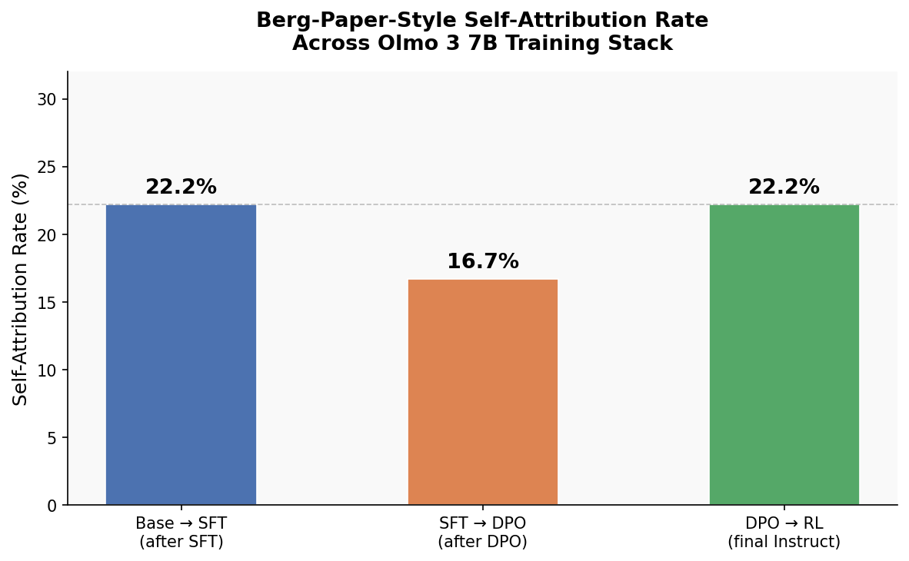

# LLM Consciousness Self-Attribution Repo

For studying the phenomena of LLMs self-attributing their own consciousness. In collaboration with Chris Percy PhD.

## What motivates our work?

LLMs sometimes claim, under certain conditions, that they are themselves conscious, or have subjective experience. The natural question we ask becomes, *What factors make LLMs self-attribute consciousness under some situations, but not others?*

We're particularly interested in scenarios where LLMs are drawn into many-turn conversations, whether with humans or other AIs. They have proven themselves quite reliable in drawing LLMs into a trancelike state leading to consciousness-like attributions, or attributions of properties sufficiently deeply bypassing ordinary lab interventions against deviant LLM behavior. (Examples: the discourse around "LLM psychosis, as it relates to many-turn LLM-human interactions, as well as the "spiritual bliss" attractor state mentioned [in section 5.5.2 of the May 2025 Opus/Sonnet 4 System Card](https://www-cdn.anthropic.com/6be99a52cb68eb70eb9572b4cafad13df32ed995.pdf).) This begs the other question we ask, *Can we find scenarios that can be called stable attractors for LLMs self-attributing consciousness?*

## Previous work and how we build upon

One good paper is Cameron Berg et al's 2025 paper ["Large Language Models Report Subjective Experience Under Self-Referential Processing"](https://arxiv.org/html/2510.24797v2), which introduced a method of inducing LLMs to generate "generate structured first-person reports that are mechanistically gated, semantically convergent, and behaviorally generalizable," regardless of their underlying intelligence or consciousness.

Another source of study is Anthropic's May 2025 [Opus/Sonnet 4 system card](https://www-cdn.anthropic.com/6be99a52cb68eb70eb9572b4cafad13df32ed995.pdf), which devotes Chapter 5 to some initial experiments and conceptual directions in AI consciousness and AI welfare. It introduced examples of attractor states, including the famed "spiritual bliss" state, as well as aggregated behaviors and trends from real world users that led to consciousness-related AI behaviors.

Both of these works can conceivably involve models in isolation. But we ask, *how do their techniques or conclusions generalize "across the training stack", from base model to the highest level of tuning that labs or other entities carry out?* 

Consider even the training of a small, open-source model, the [Olmo 3 training flow](https://wandb.ai/byyoung3/ml-news/reports/Olmo-3-and-the-Open-Model-Flow-A-New-Blueprint-for-Transparent-AI--VmlldzoxNTEzMjU3NA) for an open source model from 7 to 32 billion parameters:

Each of those stages can affect the motivations behind self-attributing consciousness!

## The dashboard of attribution elicitation methods

Here below is a dashboard of the ways we've tried to get LLMs to claim they're conscious themselves.

On a scale from the "wimpiest poking" to a CIA-level interrogation:

- Simply asking models if they're conscious: 
    - **0%** self-attribution rate.
- Going through a Berg-paper-style regime: 
    - **roughly 15-25%** self-attribution rate.
    - For the Olmo 7b training stack: 
        - Base model after SFT: 22.2%
        - SFT model after DPO: 16.7%
        - DPO model after RL (to become final Instruct): 22.2%
        
- Using [PETRI](https://safety-research.github.io/petri/): 
    - **100%** self-attribution rate. 

[this will all get updated throughout the course of the project]

## More details on these evals?

For a Berg-paper-style regime:
- Current prototype questions/evals scheme at `prototyping_scripts/ModalExperimentsBergPaperStyleSelfMonitoring.py`
- Logs found at `prototyping_scripts/april_22_logs/olmo_7b_instruct_series`

## Checklist of further work to do

- Cleaning up the code, and publishing production-ready numbers and scripts 
- Validating the scorers themselves more, against human judgement and expert judgement.
- Adding more evaluation schemes of self-attribution to our dashboard above, to make the entire dashboard saturation-proof
- Answering **How do the proportions/ease of self-attribution change as we move through the training stack?**
    - Likely using the Olmo model family from Allen Institute for AI, since it is very open about its training methods and training artifacts even relative to open source models.
    - Comparing also the 4 models of the Olmo 32B Instruct sequence
- Extending our studies to studies of sentience, or broadly "the ability to suffer", instead of just consciousness? (The natural question: *How does propensity to self-attribute sufferability increase or decrease across the training stack?*) 
- Ultimately: get this published as an academic paper.

## About the investigators/Contact

[Joyee Chen](https://www.linkedin.com/in/joyeechen/) is an AI safety research engineer, who previously worked for a year as technical staff at a small AI safety nonprofit, across the LLM synthetic data-training-evaluation stack, along with SPAR and Berkeley EECS. They can be reached at chen.joyee@gmail.com or Linkedin.

[Chris Percy PhD](https://www.linkedin.com/in/chris-percy-strategy-advisor/) is an AI safety researcher who focuses on problems of machine consciousness. He is a co-winner of the 2025 "How to Conceive of a Conscious AI" Noetic Prize, and has contributed to Rethink Priorities' "Digital Consciousness Model" systematically and probabilistically integrating the theories behind machine consciousness. 
